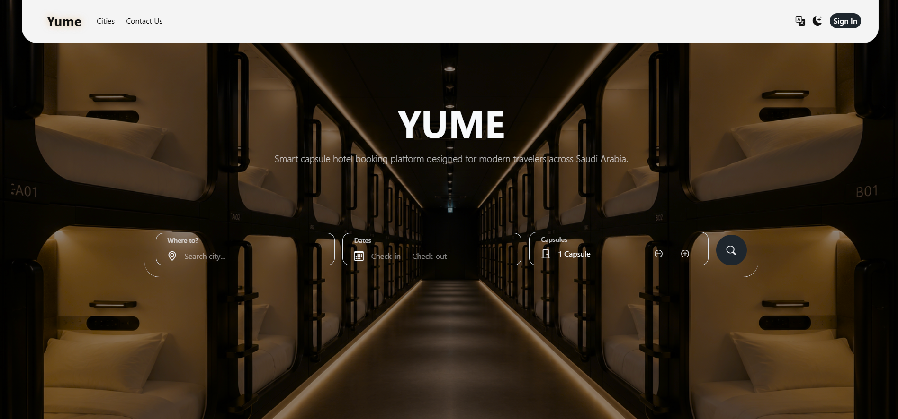
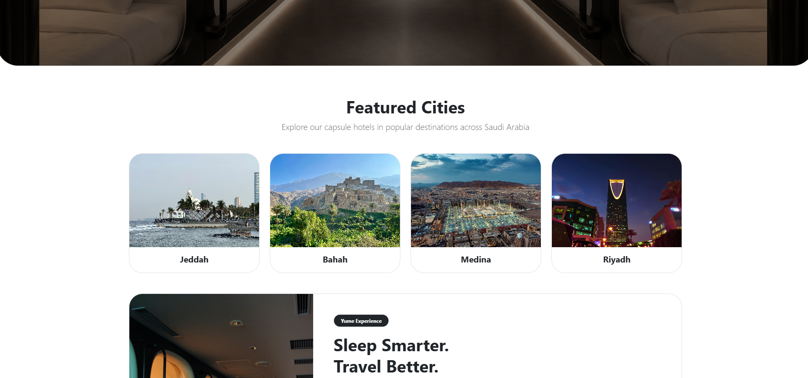
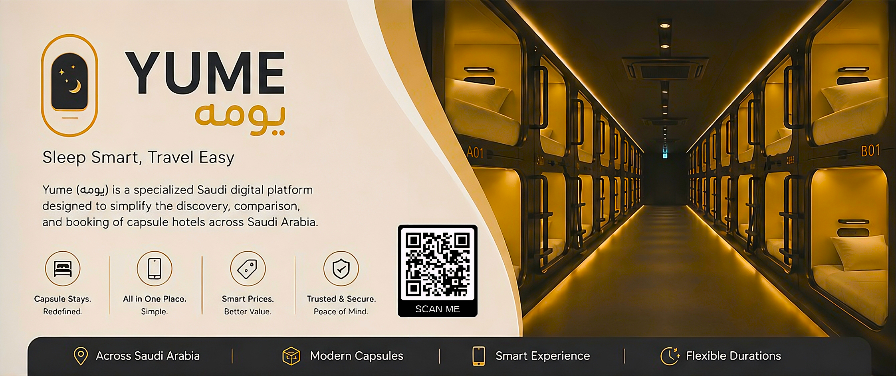

# Yume Platform (يومه)

Yume Platform is a Saudi capsule-hotel booking platform that makes it easier to discover, compare, and reserve modern, affordable stays across the Kingdom. It combines hourly and nightly booking, Moyasar payments, QR-based self check-in, and hotel-owner tools into one streamlined experience aligned with Saudi tourism growth.

[Live Demo](https://yume-platform-production.up.railway.app/)

## Highlights
- Search capsule hotels by city, name, booking type, and price.
- Book hourly or nightly stays with dynamic pricing.
- Pay securely in SAR through Moyasar.
- Generate a booking QR code PDF for self check-in.
- Give hotel owners and admins dashboards for management and approval workflows.

## Screenshots





## Key Features

### Discovery
- Browse and search capsule hotels by city, name, booking type, and price.
- Explore featured cities and hotel listings through a clean public interface.
- Switch between dark mode and light mode.

### Booking and Payment
- Reserve capsules hourly or nightly with dynamic price calculation.
- Support group bookings for multiple capsules in one transaction.
- Complete payments through Moyasar in SAR.

### QR Check-in
- Generate a QR code for each confirmed booking.
- Download booking QR codes as PDF.
- Scan QR codes at hotel entry to verify success, already-used, or expired status.

### Hotel Owner Tools
- Manage hotels, capsule inventory, and gallery images.
- View dashboard stats for hotels, capsules, bookings, and revenue.
- Publish company or owner profile pages.

### Admin and Trust
- Approve or reject hotel listings.
- Manage cities, users, and contact requests.
- Allow verified customers to leave ratings and reviews after their stay.

## Tech Stack
- Django 6.0.5
- Python 3.13.11
- Frontend: Bootstrap 5.3.8, Bootstrap Icons 1.13.1, Flatpickr, vanilla JavaScript, custom CSS
- Asset delivery: CDN via jsDelivr
- SQLite for local development
- PostgreSQL for production
- Cloudinary for media storage
- WhiteNoise for static files
- Moyasar for payments
- qrcode and reportlab for QR/PDF generation

## Getting Started

### Prerequisites
- Python 3.13.11
- A virtual environment
- An `.env` file with the required secrets and service credentials

### Install
```bash
cd YumeProject
pip install -r ../requirements.txt
```

### Environment Variables
Set the values used by `YumeProject/settings.py`:
- `SECRET_KEY`
- `DEBUG`
- `CSRF_TRUSTED_ORIGINS`
- `PGDATABASE`
- `PGUSER`
- `PGPASSWORD`
- `PGHOST`
- `PGPORT`
- `CLOUDINARY_CLOUD_NAME`
- `CLOUDINARY_API_KEY`
- `CLOUDINARY_API_SECRET`
- `MOYASAR_API_BASE_URL`
- `MOYASAR_PUBLISHABLE_KEY`
- `MOYASAR_SECRET_KEY`
- `MOYASAR_CURRENCY`

### Run Locally
```bash
cd YumeProject
python manage.py migrate
python manage.py runserver
```

## Project Structure
- `main`: homepage, shared content, and public landing pages.
- `accounts`: authentication, roles, and profile management.
- `hotels`: hotel listings, cities, and hotel content.
- `hotel_owner`: hotel owner dashboard and inventory management.
- `booking`: booking creation, booking status, and group booking logic.
- `payment`: payment flow and Moyasar integration.
- `qr_code`: QR generation, PDF output, and verification logic.
- `reviews`: customer ratings and hotel reviews.
- `administration`: admin workflows for approvals and platform oversight.

## User Roles
- Visitor: explore the platform, browse cities, and learn about available stays.
- Customer: search hotels, book a capsule, pay online, and check in with a QR code.
- Hotel Owner: list hotels, manage capsules and galleries, and track performance.
- Admin: review hotel submissions, manage cities, and monitor user activity.

## Journey Summary
- Customer journey: discover a hotel, choose a capsule, pay, receive a QR code, and leave a review after the stay.
- Hotel owner journey: register, submit a hotel for approval, then manage inventory and revenue from the dashboard.
- Admin journey: approve or reject listings, maintain the city catalog, and keep the platform trustworthy.

## Visual Assets

### Project Poster


### Project Brochure



## Deployment
The project is configured for Railway with Nixpacks. The production start command is:

```bash
cd YumeProject && python manage.py migrate && python manage.py collectstatic --noinput && gunicorn YumeProject.wsgi --bind 0.0.0.0:$PORT
```
