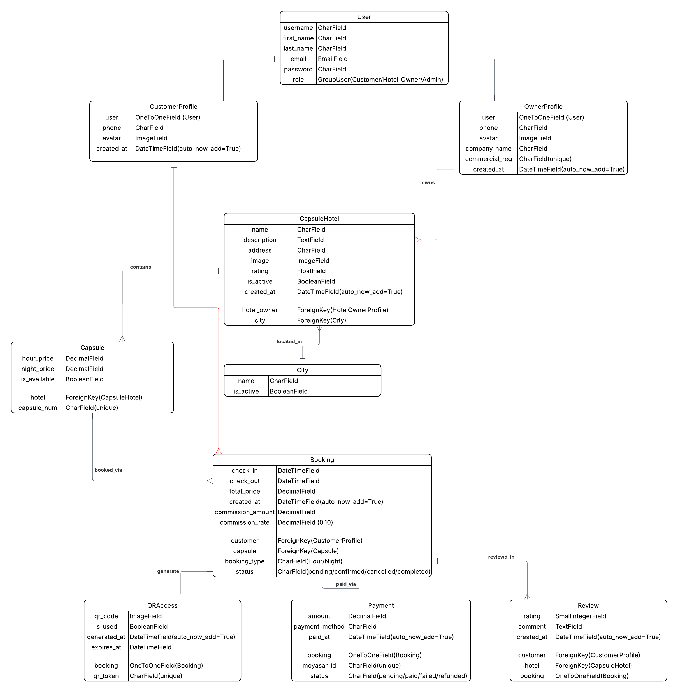

# Yume Platform (يومه)
Tuwaig Python Bootcamp group project

## Project idea:
A specialized Saudi platform designed to simplify the discovery and booking of capsule hotels across Saudi Arabia. Inspired by the Japanese capsule hotel concept and aligned with Saudi Vision 2030 tourism growth, Yume provides travelers with affordable, modern, and flexible accommodation options through a unified digital experience.

Link to the project: [Yume Platform](https://yume-platform-production.up.railway.app/)

### List of features:
- Browse and search capsule hotels by city, name, booking type, and price
- Hourly and nightly capsule booking with dynamic price calculation
- Group booking support (multiple capsules in one transaction)
- Moyasar payment integration (SAR currency)
- QR code generation per booking for self check-in, downloadable as PDF
- QR scanning verification at hotel entry (success / already used / expired)
- Hotel owner dashboard with stats (hotels, capsules, bookings, revenue)
- Hotel owner can create, update and delete hotels, manage capsule inventory, and add gallery images
- Admin panel to approve/reject hotels, manage cities, and monitor users and contact requests
- Customer profiles with booking history and review management
- Public owner/company profile pages
- Hotel reviews and ratings (verified post-booking customers only)
- Contact form for reaching the platform team
- Dark mode and light mode

### User stories:
- As a **customer**, I want to search and filter capsule hotels by city and price so I can find the best option for my stay
- As a **customer**, I want to book capsules hourly or nightly and pay securely so I can confirm my reservation instantly
- As a **customer**, I want to receive a QR code after payment so I can check in at the hotel without staff assistance
- As a **hotel owner**, I want to list my hotel and manage my capsule inventory so I can attract bookings through the platform
- As a **hotel owner**, I want a dashboard showing my bookings and revenue so I can track my business performance
- As an **admin**, I want to approve or reject hotel listings so I can maintain platform quality and trust

### Personas: [ Visitor - Customer - Hotel Owner - Admin ]

#### Persona stories:
- **Visitor**: "I want to explore capsule hotels across Saudi Arabia, browse cities, and read about the platform's services before deciding to register."
- **Customer**: "I'm looking for a quick and affordable place to stay. I want to find a hotel near me, pick a capsule, pay online, and check in using my phone — no hassle."
- **Hotel Owner**: "I want to list my capsule hotel on the platform, manage my capsule inventory and gallery, and track my bookings and revenue from a clean dashboard."
- **Admin**: "I want to review and approve new hotel listings to ensure quality, manage the city catalog, and keep an eye on user activity and contact requests."

#### Journeys:

**Customer journey**: A visitor lands on the homepage and browses featured cities. After exploring hotel listings and filtering by price or booking type, they select a capsule hotel, choose their capsule and dates, and proceed to checkout. After completing payment via Moyasar, they receive a booking confirmation with a downloadable QR code PDF to use for self check-in. Post-stay, verified customers can leave a rating and review.

**Hotel Owner journey**: An owner registers on the platform and submits their hotel for approval. Once approved by an admin, they can add capsules and gallery images, and manage their inventory. Their dashboard shows total bookings and revenue, helping them track performance.

**Admin journey**: The admin monitors incoming hotel registration requests and approves or rejects them based on quality standards. They manage the platform's city catalog, review user and contact requests, and maintain overall platform health.

### Class UML

### Project Poster

### Project Brochure

